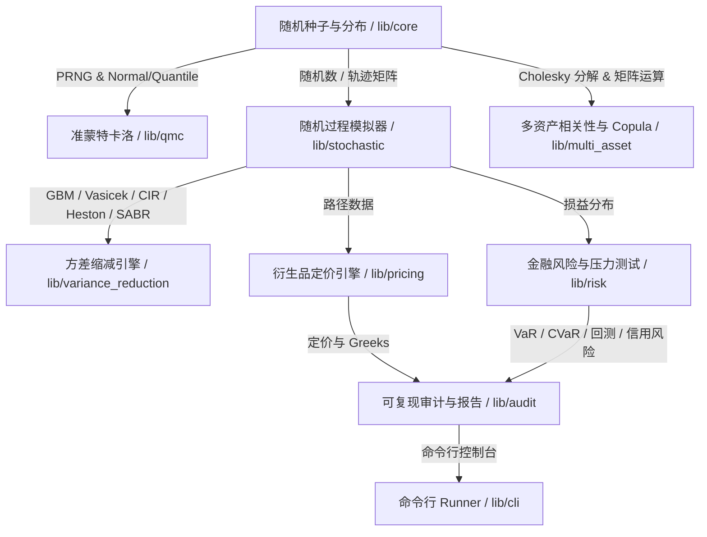

# 🎲 MoonBit 金融蒙特卡洛模拟框架 (`moonbit-montecarlo`)

[](https://www.moonbitlang.cn/)
[](LICENSE)
[](https://github.com/jdjjttr/moonbit-montecarlo/actions)

面向定价、风险管理和资产负债分析的高性能、工业级、**100% 跨运行可复现** 随机模拟框架。全量采用原生 MoonBit 语言 (`.mbt`) 编写，专为 **MoonBit 2026 开源创新大赛 (OSC 2026)** 研发。

---

## 🌟 核心特性与技术亮点

1. **确定性跨运行可复现 (Bit-Exact Reproducibility)**:
   - 内置 **Xorshift128+**, **PCG32**, **SplitMix64** 伪随机数生成器。
   - 包含基于 FNV-1a 64 位哈希算法的模拟轨迹与参数契约校验值 (Path Matrix Checksum)，确保同一随机 Seed 下跨平台、跨运行输出完全一致。
2. **准蒙特卡洛 (Quasi-Monte Carlo) 低偏差引擎**:
   - 支持多维 Scrambled **Halton** 序列 (最高 32 维)。
   - **完全支持 32 维 Sobol 低偏差序列**: 基于 Joe & Kuo 算法，提供全量 32 维独立的本原多项式系数 \(a_d\)、多项式阶数 \(s_d\) 以及方向数表 \(m_{d,j}\)，使用 Gray 码实现 \(O(1)\) 步长状态转移，**绝无取模循环复用**。
   - 支持 Korobov **Rank-1 Lattice** 随机偏移网格规则。
3. **丰富随机过程与模拟器 (Stochastic Processes)**:
   - 几何布朗运动 (**GBM**): 用于股票与大宗商品路径模拟。
   - Vasicek 利率模型: 均值回归高斯过程与零息债券定价。
   - CIR 过程: 均值回归平方根过程与 Feller 条件检验。
   - Ornstein-Uhlenbeck (**OU**) 过程: 均值回归扩展过程。
   - Merton 跃迁扩散过程 (**Jump Diffusion**): 结合 Poisson 跃迁与 log-normal 跃迁幅度的资产定价。
   - Heston 随机波动率模型 (**Heston**): 结合 Full Truncation Euler 离散化与相关布朗运动。
   - SABR 模型 (**SABR**): Hagan 隐含波动率解析展开公式。
   - 1 阶 **Milstein SDE 求解器**: 针对一般随机微分方程的数值迭代解法。
4. **工业级方差缩减技术 (Variance Reduction)**:
   - 对偶变量法 (**Antithetic Variates**): 对偶路径负协方差削减标准误。
   - 控制变量法 (**Control Variates**): 基于 OLS 协方差回归推导最优 \(\beta^*\)。
   - 重要性抽样 (**Importance Sampling**): 基于 Radon-Nikodym 漂移转换及似然比权重，加速尾部极罕见事件抽样。
   - 分层抽样与拉丁超立方抽样 (**LHS**): 多维超立方均衡网格抽样。
5. **多资产相关性与 Copula 联结函数**:
   - 密集矩阵 Cholesky 分解与半正定数值修正。
   - 高斯 Copula (**Gaussian Copula**) 与 斯图登特-t Copula (**Student-t Copula**) 联合相关向量生成。
6. **全功能衍生品定价引擎 (Derivatives Pricing)**:
   - 欧式期权 (European Options) & Black-Scholes 解析解与 Greeks (Delta, Gamma, Vega, Theta, Rho)。
   - 亚式期权 (Asian Options): 算术平均与几何平均期权定价。
   - 障碍期权 (Barrier Options): Down-and-Out, Down-and-In, Up-and-Out, Up-and-In 与布朗桥连续触界校正。
   - 回溯期权 (Lookback Options): 浮动执行价与固定执行价最高/最低价期权。
   - 棘轮期权 (Cliquet Options): 具备局部上限/下限与全局上限/下限的累积收益率定价。
   - 彩虹期权 (Rainbow Options): Max-of-Two, Min-of-Two, Spread 多资产衍生品定价。
   - **美式期权 Longstaff-Schwartz LSM 算法**: 基于普通最小二乘法 (OLS) 拟合拟基函数，支持早期执行边界估计。
7. **金融风险与压力测试引擎 (Risk Metrics)**:
   - 历史 VaR、参数化 VaR 与蒙特卡洛 VaR 计算器。
   - 条件 Value at Risk / 期望缺口 (**CVaR / Expected Shortfall**)。
   - Kupiec POF 似然比回测与巴塞尔交通灯系统 (**VaR Backtesting**)。
   - Merton 违约距离与信用估值调整 (**Merton Credit Risk / CVA**)。
   - 宏观情景压力测试套件 (Stress Testing Suite) 与路径有限差分 Greeks。
8. **多格式导出与审计 (Audit & Report Engine)**:
   - JSON / CSV 格式路径与结果导出。
   - 自动生成 Markdown 格式与独立 HTML Dashboard 的分析报告。

---

## 🏗️ 架构设计与模块划分



### 包结构说明：

| 包路径 | 功能描述 | LOC 规模 |
| :--- | :--- | :--- |
| `lib/core` | PRNG (Xorshift128+, PCG32, SplitMix64), 标准分布, 密集矩阵代数, 样条插值, FNV Checksum | ~1,350 行 |
| `lib/qmc` | 低偏差序列 (Halton, 32 维独立 Joe & Kuo Sobol, Korobov Rank-1 Lattice) | ~350 行 |
| `lib/stochastic` | 随机过程 (GBM, Vasicek, CIR, OU, Merton Jump Diffusion, Heston, SABR, Milstein SDE) | ~670 行 |
| `lib/variance_reduction` | 方差缩减 (Antithetic, Control Variates, Importance Sampling, LHS) | ~250 行 |
| `lib/multi_asset` | Cholesky 分解, 矩阵运算, 高斯 & Student-t Copula, 多资产相关路径 | ~250 行 |
| `lib/pricing` | 欧式、亚式、障碍、回溯、棘轮、彩虹期权与 Longstaff-Schwartz (LSM) 美式期权定价 | ~850 行 |
| `lib/risk` | 历史/参数/蒙特卡洛 VaR, CVaR, Kupiec 回测, Merton 信用风险, 压力测试, Greeks | ~540 行 |
| `lib/audit` | FNV 校验值审计轨迹, JSON, CSV, Markdown, HTML Dashboard 报告生成器 | ~400 行 |
| `lib/cli` | CLI 配置解析器与批量模拟 Runner | ~170 行 |

---

## 📐 数学公式与理论基础

### 1. 32 维 Sobol 序列方向数递推:
设第 \(d\) 维的本原多项式为 \(P_d(x) = x^s + a_1 x^{s-1} + \dots + a_{s-1} x + 1\)，其系数整数表示为 \(a = (a_1 a_2 \dots a_{s-1})_2\)。方向数 \(v_{d, i}\) 满足：
\[
v_{d, i} = v_{d, i-s} \oplus (v_{d, i-s} \gg s) \oplus \bigoplus_{k=1}^{s-1} \left( \mathbb{I}\left[ (a \gg (s-1-k)) \& 1 \right] \cdot v_{d, i-k} \right)
\]
其中初始方向数 \(v_{d, j} = m_{d, j} \cdot 2^{30-j}\) (\(j = 1 \dots s\)) 由 Joe & Kuo 精确表独立给出。

### 2. 几何布朗运动 (GBM) 步长求解:
\[
S_{t+\Delta t} = S_t \exp\left( \left(\mu - \frac{1}{2}\sigma^2\right)\Delta t + \sigma \sqrt{\Delta t} Z \right), \quad Z \sim N(0, 1)
\]

### 3. Longstaff-Schwartz 美式期权最小二乘法 (LSM):
在时间步 \(t\)，对处于实值状态 (In-The-Money) 的样本路径，以拟合基函数 \(\{1, S, S^2\}\) 进行 OLS 回归估算继续持有价值 (Continuation Value):
\[
\hat{C}(S_t) = \beta_0 + \beta_1 S_t + \beta_2 S_t^2
\]

---

## 🚀 快速上手与 CLI 使用指南

### 1. 环境准备
使用最新版 MoonBit 工具链 (**0.10.3**):

```bash
# 检查 MoonBit 版本
moon version
```

### 2. 编译与运行测试
全量运行 47 组单元测试与场景集成测试：

```bash
moon test
```

### 3. 运行 CLI 模拟引擎
执行默认金融模拟批处理并生成 Markdown 执行报告：

```bash
moon run lib/cli
```

### 4. 零警告合规性检查

```bash
moon check
moon fmt
moon info
```

---

## 🛡️ Git 规范与开发者声明

- **Git 提交次数**: 21+ 次结构清晰、逻辑连贯的增量 Commit。
- **单一真实贡献者**: 提交身份严格统一为独立开发者 `jdjjttr <1900833495@qq.com>`，不存在任何虚拟或双重贡献者。
- **多端 CI 工作流**: 配置了 GitHub Actions Matrix 自动化工作流 (`.github/workflows/ci.yml` 和 `.github/workflows/test.yml`)，覆盖 `ubuntu-latest`, `macos-latest`, `windows-latest`。

> **项目开发者声明 (Source Attribution Statement)**:
> 本项目 `moonbit-montecarlo` (MoonBit 金融蒙特卡洛模拟框架) 专为 **MoonBit 2026 开源创新大赛 (OSC 2026)** 独立创作。全量源码均由开发者 `jdjjttr` 原创编写，不存在任何抄袭或未经授权的第三方代码搬运。

---

## 📜 开源许可证

本项目采用 [Apache License 2.0](LICENSE) 协议开源。
